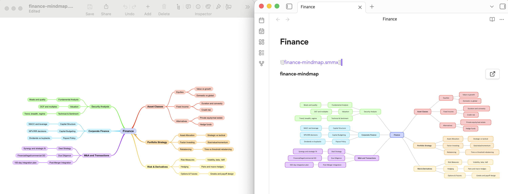

# SimpleMind Preview (Obsidian Plugin)

Render inline previews for SimpleMind `.smmx` embeds in Obsidian.

Left: SimpleMind Mac app vs Right: Obsidian SimpleMind Preview Plugin

## Usage

- Embed a map in any note to render an inline SVG preview:
  - `![[example.smmx]]`
- Preview behavior:
  - Works in reading mode and live preview/source mode.
  - Supports zoom and drag for larger maps.
  - Opens in SimpleMind Pro from the preview header or by clicking a node.
- Use command palette commands:
  - `Create & insert new mindmap`
  - `Create & insert new mindmap (current note name)`

## Install

### Local dev install (`.env`)

1. Copy `.env.example` to `.env`.
2. Set `OBSIDIAN_VAULT_PATH` to your vault's absolute path.
3. Run:
  - `npm run build-and-install`

This script builds and copies release files into your local vault plugin directory.

## Settings

- **Enable previews**
- **Max preview height**
- **Default zoom**
- **Use SimpleMind palette**
- **Template path**

## Development

- `npm run dev`: watch build during development.
- `npm run build`: one-off production build.
- `npm run install-plugin`: copy release files to `<OBSIDIAN_VAULT_PATH>/.obsidian/plugins/simplemind-preview/`.
- `npm run build-and-install`: build and then install into local vault.

## Release Artifacts

The plugin package consists of:

- `dist/main.js` (copied as `main.js` into the Obsidian plugin folder)
- `manifest.json`
- `styles.css`

## License

MIT. See `LICENSE`.

## Author

Brett Winterflood